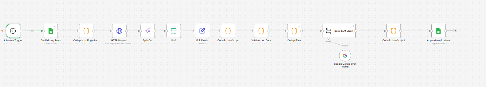
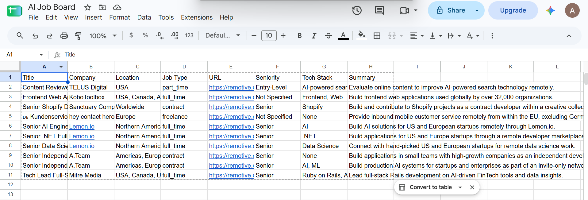

# AI Job Board Automation (n8n)

An automated pipeline built with n8n that fetches live remote job
listings from the Remotive API, uses Google Gemini to classify each
job by seniority and tech stack and generate a summary, filters out
duplicates and incomplete listings, and writes the results into a
Google Sheet — creating a self-updating, AI-curated job board.

## Architecture

**Flow:**
1. **Schedule Trigger** — runs automatically on a daily schedule
2. **Get Existing Rows** — reads the Google Sheet to check what's already been added
3. **Collapse to Single Item** — ensures the next API call runs exactly once
4. **HTTP Request** — fetches live job listings from the Remotive API
5. **Split Out** — breaks the API response into individual job items
6. **Limit** — caps the batch size to stay within Gemini's free-tier rate limits
7. **Edit Fields** — selects the relevant fields from each job
8. **Code (HTML Cleaner)** — strips HTML tags and formatting from job descriptions
9. **Validate Job Data** — filters out incomplete/broken listings
10. **Dedup Filter** — compares against existing sheet rows and removes duplicates
11. **Basic LLM Chain (Google Gemini)** — classifies seniority, tech stack, and generates a one-line summary for each job
12. **Code (Parser)** — parses the AI's JSON response and recombines it with the original job data, discarding malformed AI responses
13. **Google Sheets (Append Row)** — writes each new, validated, enriched job as a row

## Features

- Automated daily fetching of live remote job listings
- AI-generated seniority classification, tech stack tags, and summaries
- Duplicate prevention across repeated runs (URL-based deduplication)
- Data validation to filter out incomplete listings
- Defensive error handling for malformed AI responses
- Clean, structured output written directly to Google Sheets

## Tech Stack

- **n8n** (self-hosted via Docker)
- **Remotive API** (public, no authentication required)
- **Google Gemini API** (gemini-3.5-flash-lite)
- **Google Sheets API** (OAuth2)

## n8n Nodes Used

| Node | Purpose |
|---|---|
| Schedule Trigger | Runs the workflow automatically on a timer |
| Google Sheets (Get Row(s)) | Reads existing sheet data for deduplication |
| Code | Multiple uses: batching control, HTML cleaning, validation, JSON parsing |
| HTTP Request | Fetches job listings from the Remotive API |
| Split Out | Converts a nested jobs array into individual items |
| Limit | Caps batch size per run |
| Edit Fields | Selects and reshapes relevant job fields |
| Basic LLM Chain | Sends job data to Gemini for classification |
| Google Gemini Chat Model | AI model powering the classification |
| Google Sheets (Append Row) | Writes enriched job data as new rows |

## Setup Instructions

1. Clone this repository
2. Import `workflow.json` into your n8n instance
3. Set up credentials:
   - **Google Gemini API key** — free at [aistudio.google.com](https://aistudio.google.com)
   - **Google Sheets OAuth2** — via [Google Cloud Console](https://console.cloud.google.com); enable the Google Sheets API and Google Drive API
4. Create a Google Sheet with columns: `Title | Company | Location | Job Type | URL | Seniority | Tech Stack | Summary`
5. Update the Google Sheets nodes to point to your sheet
6. Adjust the Limit node and Schedule Trigger interval as needed
7. Activate the workflow

## Credentials Needed

- Gemini API Key
- Google OAuth2 Client ID + Client Secret (Sheets + Drive API access)

## Known Limitations

- Batch size is capped (~8-10 jobs per run) to stay within Gemini's free-tier rate limits; a production version would use a proper rate-limited loop (see Future Improvements)
- Deduplication is based on job URL; if Remotive changes a job's URL, it could be re-added as a "new" listing
- Job descriptions are truncated to 500 characters before AI analysis, for cost/token efficiency

## Future Improvements

- Implement a Loop Over Items + Wait pattern to safely process unlimited jobs without hitting rate limits
- Aggregate listings from multiple job APIs, not just Remotive
- Add an AI relevance/fit score against a defined candidate profile
- Add failure notifications (Slack/email alert on workflow error)
- Store historical data to track job market trends over time

## Example Output

